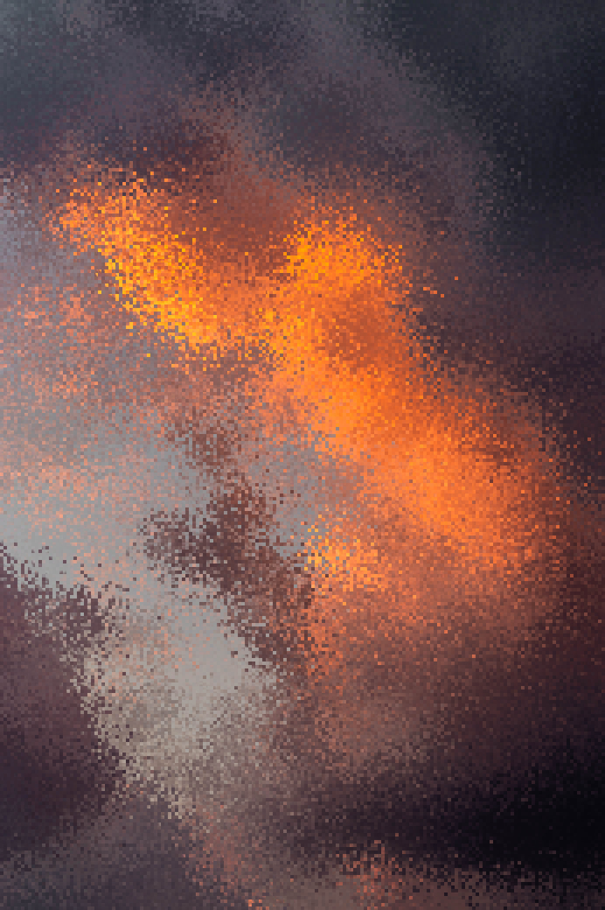
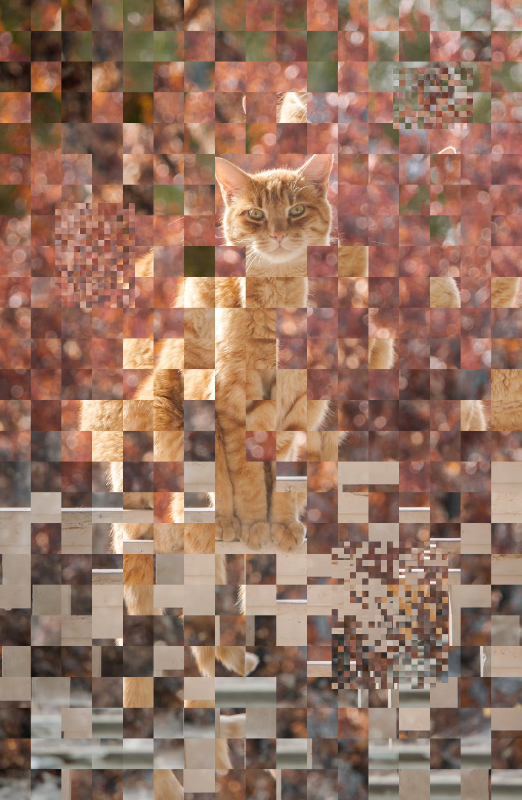
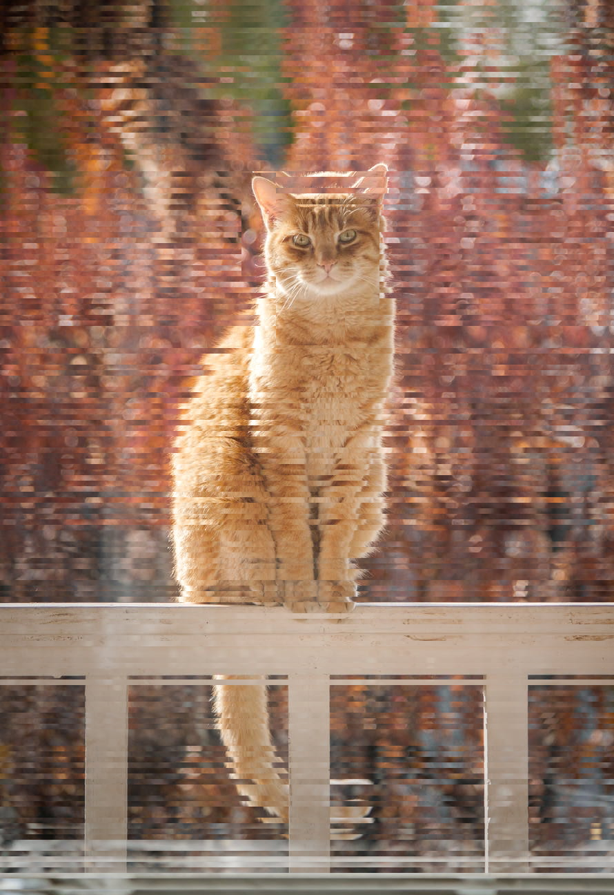

# Auto Shuffle Checkered Collage

## What is this?
We can come up with image transformations/effects that are based on dividing up a picture into a rectangular grid.
This program is for working with these kinds of effects much more comfortably and quickly than "by hand".
I've come up with a couple, focusing more on automatically "shuffling" chunks of the image, but more can be implemented.

## Examples of results obtained with this program:





Image sources: [sunset](https://www.pexels.com/photo/clouds-2627945/), [cat](https://www.pexels.com/photo/tabby-cat-982314/).

## How to run it
We need to have Pillow installed. We can install it with pip, as detailed in [their documentation](https://pillow.readthedocs.io/en/stable/installation.html):
```
python3 -m pip install --upgrade pip
python3 -m pip install --upgrade Pillow
```

## Current features
* Click and drag to select/unselect cells
* The selected cells are not unselected upon resizing the grid, but "stretched".
* Undo, redo, cropping, or saving actions, do not alter what cells are selected. 
* Keyboard shortcuts
  * Ctrl+z to undo
  * Ctrl+shift+z to redo
  * Ctrl+a to select all the cells
  * Esc to unselect all the cells
* Get square cells checkbox
* Show grid checkbox
* Buttons
  * Save image (in all the formats supported in Pillow, such as jpeg, jpg, gif, etc)
  * Load image
  * Reset image, reloads from disk the last loaded image
  * Crop evenly to grid size, "trims off" how much of the picture makes it not evenly fit in a grid of the current size
  * Undo
  * Redo
  * Swap two cells, swaps the first two selected and no more
  * Replace with original cells
  * Shuffle pasting. It prompts the user for a number. For every selected cell, it copies it and pastes it in a random cell as close or closer than the number the user provided.
  * Shuffle swapping. It prompts the user for a number. For every selected cell, it looks a few times for a selected cell as close or closer than the number provided by the user, then swaps these two cells or gives up.
  * Make red, and red checkers. These were originally intended only for debugging, but I decided to leave them in to stimulate creative ideas in others.
  
##
Note: I strongly recommend to crop evenly to grid size before doing any swapping, so as to avoid swapping with cells that have blank/black peaces that fell "outside" the image.

##
Thanks for reading! Feel free to contact me, if you have any questions, find a bug, etc.
